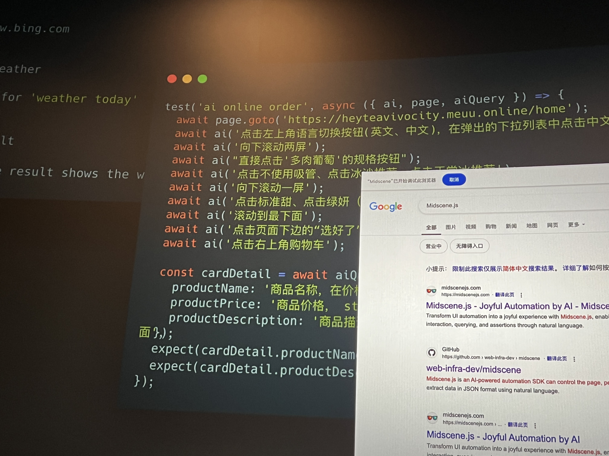
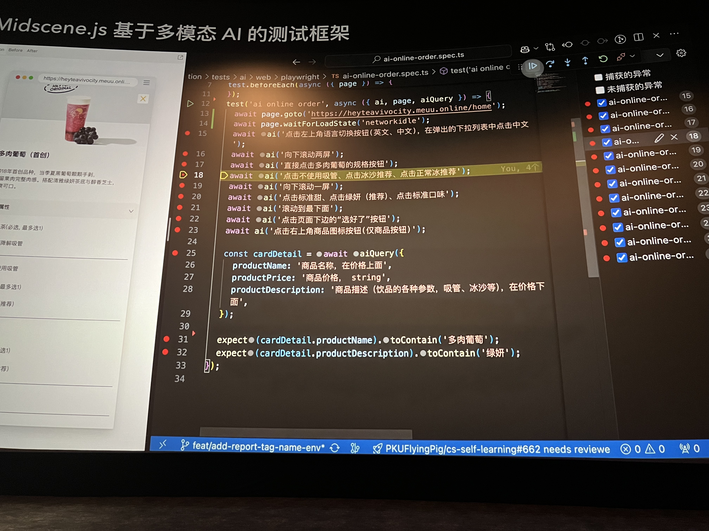
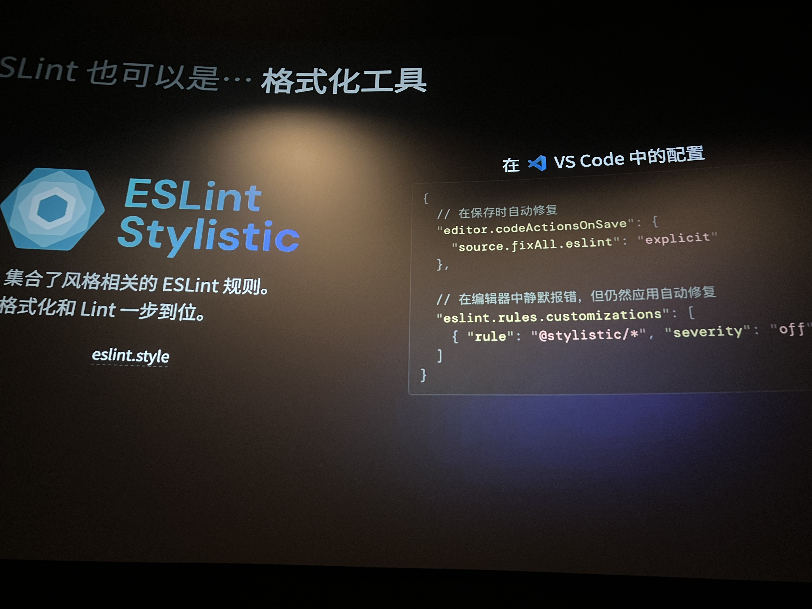
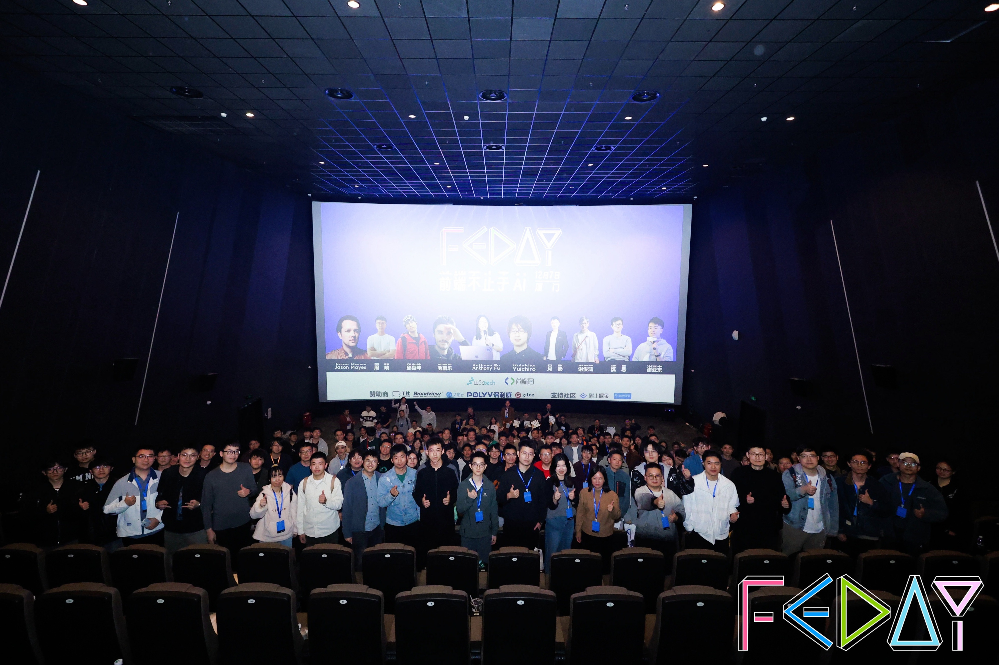

## 前言

> 以下内容为个人回忆记录，可能会有疏漏，可在评论区补充。

今年的前端圈基本都是关于 AI 的分享，10场只有3场是关于，前端框架或者工具的。本来个人是有点抵触的，但是后来就想通了，既然 编码的目的是解放生产力 为什么不能 `ai for all` 呢？

大家都是一群爱折腾、有好奇心的人,前端技术日新月异，好玩的东西层出不穷，这次的主题就是编码想要有AI的加持，应该怎么玩？

 ai 想要落地，前端开发者的挑战也是不小的。比如： 模型的本地优先如何实现，因为想要真正的落地，比如视频追色，把每一帧都搞到服务器上给模型解析再返回到客户端，费用将会异常的恐怖。

再比如，如何利用wasm加速ai模型推理，如何保证用户隐私，如何避免 ai 投毒，想想就非常有趣。


## 使用 Gradio 和 Transformers 构建 Web AI应用 

分享嘉宾：Yuichiro

Yuichiro 是专门从日本来的嘉宾，就职于 Hugging Face, 是一个很有趣的人，演讲的时候可能有点紧张，说的英语在颤抖。

他主要分享了前端如何借助 WebAssembly 去吃到 Python AI生态系统的成果。

> [Pyodide](https://pyodide.org/en/stable/), 是一个基于 WebAssembly 的浏览器和 Node.js 的 Python 发行版。

然后还分享了 如何利用 [Gradio-lite and Transformers.js](https://www.gradio.app/guides/gradio-lite-and-transformers-js)去构建无服务的前端应用。（震惊 🤯 竟然在HTML写 Python 代码，是个狠人）

> 这里有关于演讲的示例演示：
> 1. https://github.com/whitphx/transformers.js.py?tab=readme-ov-file
> 2. https://www.gradio.app/guides/gradio-lite

## Ling：AI 流式结构化输出解决方案

分享嘉宾：月影

月影老师是如雷贯耳的老前辈，从事开发已经二十几年了，他最近也在进行关于 ai 的创业，是专注于教学儿童方面的，提供的载体是微信小程序，叫做 波波熊学伴，体验了一下，感觉挺好的，只需要提供故事名，就能完整的构造一个故事流程，可以方便的学习英语。

他这次分享的是关于 [AI 流式响应框架 Ling ](https://ling.bearbobo.com/)，并且分享了JSON作为模型的输入输出，是有多么的高效，第一次见确实长见识了，特别对构建 AI 工作流非常有帮助。

大模型的流式输出是非常重要的，但是因为 JSON 是一种封闭的数据结构，导致流式输出之后到前端，开发者很难处理这些数据，所以就有了  Ling 这个工具，它的核心是一个实时解析 JSON Token 的解析器，将实时解析的内容立即以 Stream 的方式返回。让整个流程更加高效。

这场学习到了各个大模型之间互相协作的可能性，见识到了模型对 JSON 理解程度之强，以后感觉不用再傻傻的写一堆提示词了。

## 如何打造属于自己的 Cursor

分享嘉宾：谢俊鸿

这位嘉宾是来自蚂蚁集团云研发团队的技术专家，OpenSumi 负责人。他主要分享的是当前的 AI 编码辅助，如何突破 VS Code 的瓶颈，突破他的局限性进一步的发展，因此他们推出了 [opensumi](https://opensumi.com/zh) ，用来快速的搭建本地的 IDE。并且演示了一些插件如何开发，整个文档也是写得非常详细非常好，是个很厉害的团队。还推出了在 web 上就能体验到的AI编辑器 [Codeblitz](https://codeblitz.opensumi.com/en).

编写 AI 编辑器这个需求比较少，但是如果需要，这个项目将提供极大的帮助，并且提供的一些API调用范式也非常符合直觉。

详细用过的都能领略到Ai编辑器的强大，我最近也一直在使用 windSurf 对于整个生产力的提升不是一点半点，但是也有一定的弊端，容易出现以下情况:


## 2024 年的 Web AI：现代 Web 应用的超级能力

分享嘉宾： Jason Mayes

Jason Mayes 也是老面孔了，他是谷歌 Web AI 主管，之前学习 tensorflow.js 的时候就一直看见他在宣传。他这次也是在推广 AI模型在本地优先领域的应用。


## Web3D 开发中 AIGC 的探索及工作流实践

分享嘉宾:慎思

他是蚂蚁集团 Galacean 的团队技术专家、渲染和数字人方向负责人，他主要分享了一个通过AI大模型加持的 Web3D 互动图形引擎,也就是Galacean，他们正在探索将图片生成一个 Web3D 的场景的能力，可以简单直接的拖放到场景中，去解决一些简单的需求。

他们还在探索一些预测下一步行为的模型,类似下面的运动扩散模型，这样可以更好的生成随机动画，进一步提高效率.

这个运动扩散模型，在进行AI照片修复也拥有非常强大的应用前景。

<video style="width: 100%;" controls>
  <source src="./xx.mp4" type="video/mp4">
</video>

并且探索了 AIGC 在编辑器中如何建模、贴图、动画和脚本等环节进行简化，甚至直接交给AI的探索，也是能颠覆未来 3D 从业人员的领域。最近 Google 也发布了一个，通过大模型来生成基础世界的研究，感觉非常厉害，可以想象，大模型才出来两年就有这么强的应用，以后必将更进一步的解放生产力。

> [Genie 2: A large-scale foundation world model](https://deepmind.google/discover/blog/genie-2-a-large-scale-foundation-world-model/)

## Midscene.js 用 AI 构建下一代 e2e 测试工具

分享嘉宾：周晓

这位是字节跳动 Web infra 团队成员，微前端技术方向负责人，他带来的是颠覆测试工具的一个运用自然语言编写测试的项目。直接看两个图更加的直观。




通过自然语言来对抗页面UI的变化，过程不输出任何的代码，并且能进行结果断言，这个项目实在是前途无量。其通过自然语言的编写测试用例的方式极大的提升了测试用例的可维护性和编写成本。

这个项目可以配置open AI 的key,也提供了自定义模型的服务,可以借助 ollama 进行本地模型推理，在公司内网部署一个，感觉会非常不错。

> https://midscenejs.com/

## 基于端+云打造 AI 应用

分享嘉宾：谢亚东

东哥是Lepton AI 创始成员，他们公司主要提供 AI云服务，可以帮助用户去快速构建 AI应用。

主要通过展示一些 AI 在硬件或者软件运用的示例。
比如：[ai-recorder](https://github.com/vthinkxie/ai-recorder)。这个模型对声音和噪音的感知挺厉害的，就是裁剪过的版本对中文支持不太友好。
这个让我们直观的感受到AI 在端侧和云侧的互相配合，并且展示了如何使用 ServerWorker 的 Cache 等手段，对端侧的AI模型进行优化，去做到本地优先，进一步减少成本。

## Qwik: Resumability(可恢复性) 将引领时代

分享嘉宾：毛雨乐（Maïeul）

毛雨乐来自法国，是个很友善的人,结束之后还发Qwik贴纸，给大家看他 PPT 开头。


他虽然是法国人，但是全程使用中文进行演讲，非常厉害。他这次是他第一次演讲，带来的是Qwik.js。

Qwik.js 的核心理念是 "Resumability"（可恢复性），不像传统框架那样在客户端完成全面的重新渲染（hydration）不需要在客户端重新初始化组件，而是直接恢复服务器渲染的状态。这种机制可以显著减少页面加载时间。按照他来说加载速度确实极快，

简单来说就是不用在服务端渲染一次，然后再客户端在进行重新渲染。如果您最求极致的性能Qwik确实是一个选择，就是不知道跟Svelte没有运行时开销的框架对比起来咋样。

Qwik现在的缺点是生态还在发展中，并且有一些`$`新式的API.

## 微信端内网页远程调试及断点原理

分享嘉宾：邱焱坤

这位大佬是来自腾讯微信公众号团队高级前端工程师，他分享的是 基于Chrome DevTools Protocol实现了纯前端的调试工具 [mprdev](https://github.com/wechatjs/mprdev),通过websocket 等形式将调试信息发送至Chrome DevTools中来进行调试。很大程度上提升了调试能力。

并且还抽象出了断点工具[vDebugger](https://github.com/wechatjs/vdebugger),以支持在JSCore等非浏览器环境下进行断点调试。

## ESLint One for All Made Easy

分享嘉宾：Anthony Fu

Anthony Fu 大家应该都认识，是一个狂热的开源爱好者，前端都或多或少使用过他开发的工具。

这是他参与的开源项目，还做了很多帖子发，真好。


他主要介绍了 ESLint 的[可视化配置检查器](https://eslint.org/blog/2024/04/eslint-config-inspector/)

```bash
eslint --inspect-config
```

并且带来了ESLint[扁平化的配置指南](https://nuxt.com/blog/eslint-module)。确实 `eslint.config.js`的写法更加的符合直觉，对代码的掌控也更加好。

还解决我一个痛点就是可恶的红色波浪线。只需要如下配置：




## 结束语

AI 最后将会变成和空气一样的存在，因为我们的最终目的是解放生产力，解放生产力才能更好的去实现共产主义。
但是也不能过度的去依赖AI，我们需要借助AI去干一些繁琐的事情，我们才有时间去做一些有创造性有趣的事情和挑战。因此保持学习和思考是当前AI浪潮下，我们需要做的。

最后放一个大合照。



